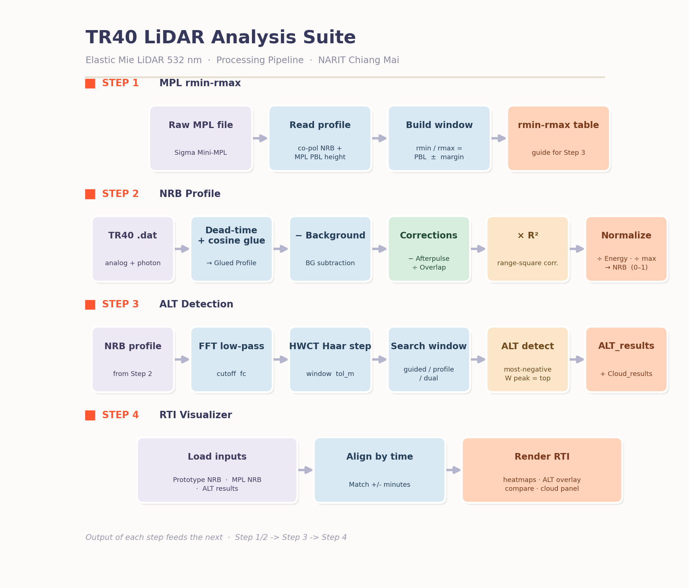
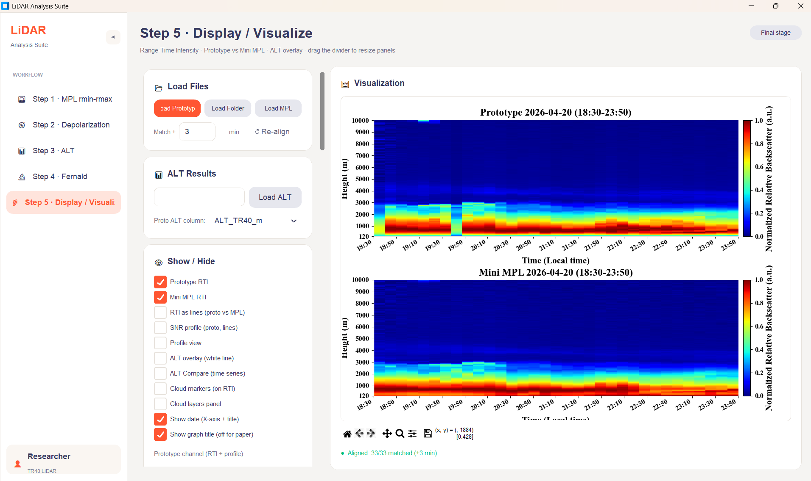
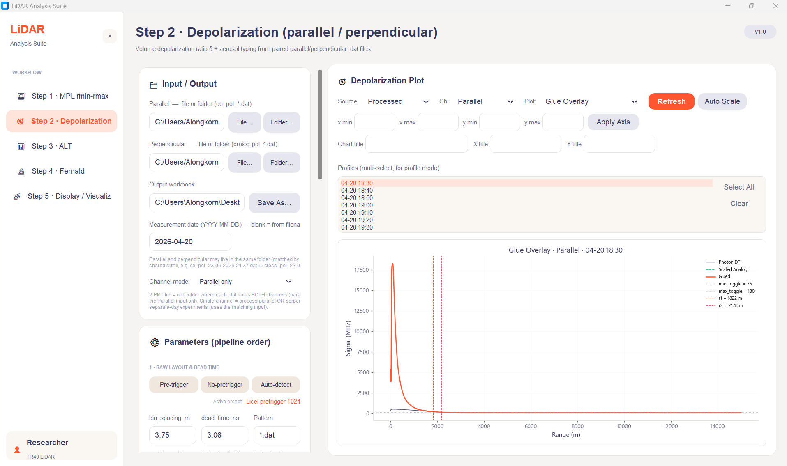

# TR40 LiDAR Analysis Suite

Research-grade processing for the **TR40 elastic Mie LiDAR (532 nm)** at NARIT, Chiang Mai, Thailand. A 5-step desktop workflow that turns raw photon-counting / analog `.dat` files into normalized relative backscatter (NRB), aerosol layer top (ALT), range-time-intensity (RTI) imagery, and Fernald/Klett aerosol-property retrievals (β_aer, α_aer, AOD).



---

## Screenshots

**Step 5 — Range-Time Intensity: Prototype TR40 vs Mini-MPL** (time-height backscatter, auto time-aligned)



**Step 2 — Depolarization & analog↔photon glue overlay** (per-profile glue with toggle-rate window)



---

## Pipeline at a glance

| Step | Page | Input | Output |
|------|------|-------|--------|
| 1 | **MPL rmin-rmax** | Raw Sigma Mini-MPL file | `rmin-rmax-*.xlsx` (search-window guide) |
| 2 | **NRB Profile** | TR40 `.dat` (analog + photon) | `NRB-*.xlsx` (daily NRB profile) |
| 3 | **ALT Detection** | NRB profile + rmin-rmax | `ALT_NRB-*.xlsx` (ALT, clouds, QC) |
| 4 | **RTI Visualizer** | Prototype NRB + MPL NRB + ALT | RTI heatmaps + ALT overlay + compare panel |
| 5 | **Fernald Inversion** | NRB profile | `Fernald-*.xlsx` (β_aer, α_aer, AOD) |

### Step 2 — NRB derivation (full chain)
```
raw analog + photon  →  dead-time correction  →  toggle fit + cosine glue
   →  − Background  →  − Afterpulse A(R)  →  ÷ Overlap O(R)
   →  × R²  →  ÷ Energy  →  ÷ max  →  NRB
```

### Step 3 — ALT detection
FFT low-pass (cutoff `fc`) → HWCT Haar step (half-window `tol_m`) → pick the most-negative W peak (= falling edge = layer top) inside a search window.

Detection modes: `mpl_guided` · `nrb_profile` · `dual` (default).

### Step 5 — Aerosol inversion
Fernald (1984) or Klett (1981) backward inversion. Rayleigh-normalised via β_mol(R_ref), so no separate lidar constant is required. Uses US Standard Atmosphere (ISO 2533) for the molecular profile by default.

---

## Installation

Requires **Python 3.10+**.

```bash
git clone https://github.com/<your-user>/lidar-processing-2026.git
cd lidar-processing-2026
python -m venv .venv
.venv\Scripts\activate          # Windows  (use:  source .venv/bin/activate  on macOS/Linux)
pip install -r requirements.txt
```

## Running the GUI

**Desktop (CustomTkinter, full-featured):**
```bash
python main_v2.py
```
The primary desktop GUI; legacy `main.py` (plain Tkinter) is kept as fallback.

**Web (Streamlit, deployable):**
```bash
streamlit run streamlit_app.py
```
Opens at `http://localhost:8501`. Each step is its own page in the sidebar.
Output of Step N is held in `st.session_state` so Step N+1 picks it up
automatically — no re-uploading between steps.

### Deploy to Streamlit Community Cloud
1. Push this repository to GitHub.
2. Sign in at <https://streamlit.io/cloud> with the same GitHub account.
3. **New app** → pick the repo → set **Main file = `streamlit_app.py`**.
4. Streamlit Cloud auto-installs from `requirements.txt`. App URL appears in ~1 min.
5. The `.streamlit/config.toml` carries the Bao colour theme.

Note: Streamlit Cloud has an ephemeral filesystem — users upload inputs and
download outputs (no persistent disk).

---

## Repository layout

```
.
├── main_v2.py              ← primary GUI (5 steps)
├── main.py                 ← legacy GUI / helper functions
├── bao_theme.py            ← UI theme tokens
│
├── nrb_engine.py           ← Step 2 backend  (NRB pipeline)
├── pbl_engine.py           ← Step 3 backend  (FFT + HWCT, run as CLI)
├── fernald_engine.py       ← Step 5 backend  (Fernald / Klett inversion)
├── overlap.py              ← O(R) — Rice-CDF analytical + file load
├── afterpulse.py           ← A(R) — .dat / CSV / Excel loaders
│
├── streamlit_app.py        ← web entry (Streamlit Home page)
├── pages/                  ← Streamlit auto-discovered step pages 1–5
│   ├── 1_📁_MPL_rmin-rmax.py
│   ├── 2_📈_NRB_Profile.py
│   ├── 3_📊_ALT_Detection.py
│   ├── 4_🌈_RTI_Visualizer.py
│   └── 5_🔬_Fernald.py
├── .streamlit/config.toml  ← Bao colour theme for Streamlit
│
├── MPL data/               ← sample Mini-MPL CSV (input for Step 1)
├── afterpulse.dat          ← detector afterpulse calibration file
├── LiDAR_pipeline_flowchart.png
├── requirements.txt
└── README.md
```

---

## Hardware

| Component | Spec |
|-----------|------|
| Telescope | Celestron EdgeHD 800 (D = 203 mm, f = 2032 mm) |
| Laser | Quantel VIRON, 532 nm |
| Detector | Licel PM-HV + Hamamatsu R9880U PMT |
| Geometry | Biaxial, d⊥ = 148.12 mm |
| Bin spacing | 3.75 m (25 ns) |
| Overlap | O = 0.5 @ 77 m,  O = 0.99 @ 142 m |

---

## Science notes

* **NRB** (Normalized Relative Backscatter) follows the Sigma-MPL convention:
  `NRB = (Raw·DT − Afterpulse − BG) / (Overlap · Energy) · R²`, then `÷ max` for plotting.
* **ALT detection** uses HWCT (Brooks 2003) with the convention `W = mean(upper) − mean(lower)`. The aerosol layer top is therefore the **most-negative** W peak (falling edge); the engine prefers it as of `PBL_VERSION = 3`.
* **Fernald inversion** is self-calibrating through the Rayleigh boundary condition `β_total(R_ref) = β_mol(R_ref)`, so the unknown lidar constant cancels algebraically. The NRB normalisation by energy and max therefore does not affect the recovered β_aer.

### References
- Fernald F.G. (1984), *Appl. Opt.* **23**(5), 652-653.
- Klett J.D. (1981), *Appl. Opt.* **20**(2), 211-220.
- Brooks I.M. (2003), *J. Atmos. Oceanic Technol.* **20**, 1092-1105.
- Collis R.T.H. & Russell P.B. (1976), *Meteorological Monographs* **15**(37).
- Weitkamp C. (ed.) (2005), *Lidar: Range-Resolved Optical Remote Sensing of the Atmosphere*.

---

## Roadmap

- [ ] **Track 2 — Cross-polarization** (depolarization ratio δ). Requires hardware installation. Will improve aerosol-type discrimination and ALT detection where the parallel profile lacks a sharp boundary-layer top.
- [ ] **Streamlit port** of the GUI for web deployment (engines are already framework-agnostic).
- [ ] Optional: cloud optical depth / cloud-type product.
